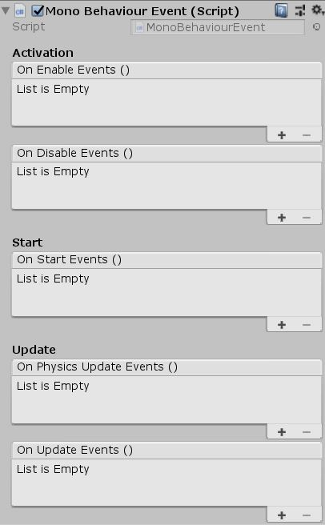

# Unity-Mono-Behaviour-Event

Small module to synchronize actions with MonoBehaviour functions

*Can be attach with Component --> UniCraft --> MonoBehaviourEvent*

# Information

Tested on Unity **2018.3.0b**

Version **1.0.0**

# Screenshots

# License

MIT License